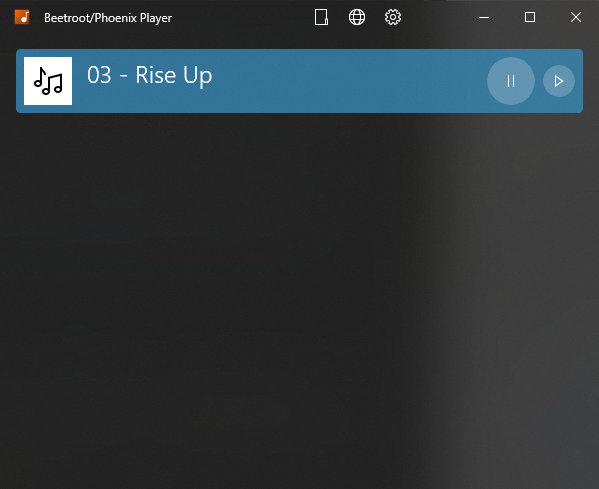

# Beetroot/Phoenix Player

Beetroot Player is a "boombox" sort-of software which allows you and the members of your group to queue and play music.

Right now, it's only a crappy music player, but I will eventually make it so the user's guests can requests songs. But that will be done half-way through the implementation of the web service.

## Projects

* [Phoenix.UWP] - Windows 10 app / Universal Windows Platform
* [Phoenix.WinForms] - (tbd) Reference desktop app
* [Phoenix.Cloud] - (tbd) Beetroot/Cloud Service Library

## Notes on Rewrite

This is a rewrite of the now terribly convoluted [beetroot-next] codebase I've started in 2018. As opposed to writing for a "one-size fits all" Electron app. I've decided to go for writing the codebase natively for each platform.

This is why this is called "Phoenix," rising from the ~~ashes~~ broken codebase.

I have yet to decide whether the macOS/Linux implementations are going to use their "native" languages, or C# through Xamarin and whatnot. We'll see.

[beetroot-next]: https://github.com/thegreatrazz/beetroot-player

## Screenshots

## Building

In a perfect world, you'd download the whole thing and everything works. But alas, it is not.

* [Phoenix.UWP] - make sure you have the UWP workflow installed
* [Phoenix.WinForms] - make sure you have the desktop workflow installed
* [Phoenix.Cloud] - whatever is needed for .NET Standard class libraries 🤷‍♂️

[Phoenix.UWP]: Phoenix.UWP
[Phoenix.WinForms]: Phoenix.WinForms
[Phoenix.Cloud]: Phoenix.Cloud

